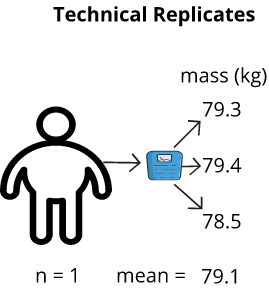
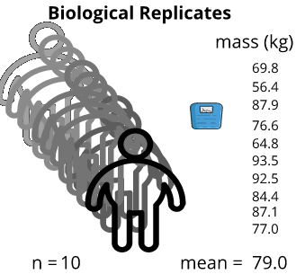

---
# Please do not edit this file directly; it is auto generated.
# Instead, please edit 03-common-failings.md in _episodes_rmd/
title: Common failings
teaching: 20
exercises: 15
questions:
- "What are some common features of poor experimental design?"
- "What are some consequences of poor experimental design?"
objectives:
- "Differentiate between technical and biological replicates."
- "Describe what could happen to an experiment if technical replicates are used in place of biological replicates."
keypoints:
- "When designing an experiment, use biological replicates."
- "Choose a single representative value (the mean, median, or mode) for technical replicates."
source: Rmd
---

### Selective publication of positive results
Publication bias favors studies producing positive results over those that do not, regardless of the quality or design of the study. In clinical trials, one estimate finds that studies with statistically significant results are published at three times the rate of those with null results (Dickersin et al, 1987). As a consequence, much of published clinical research consists of false positives. This can have real impact on people's lives, given that published literature serves in medical decision-making. In one meta-analysis, 94% of published literature from clinical trials in antidepressants reported positive results (Turner et al, 2008). Medical decisions based on selective publication of positive results may lead to suboptimal outcomes for patients. Different scientific research domains tend to [accentuate the positive](https://www.nature.com/news/485298a-i2-0-jpg-7.4428?article=1.10634) at different rates, with psychiatry and psychology reporting the highest rates of publication of only positive studies, and earth and space sciences reporting the lowest rates (Yong, 2012).

### Incorrect randomization
A well-designed experiment avoids confounding from known and unknown influences. Randomization creates comparable groups, which are alike in all characteristics except for the treatment under study. Randomization eliminates selection bias, balances the groups, and forms the basis for statistical tests. Poor randomization introduces confounding variables and frustrates attempts to quantify the effect of a treatment. If treatment groups differ with respect to factors other than the treatment under study, the results will be biased. In a clinical trial, for example, if younger participants were assigned the treatment and older participants were in the control group, there would be no way to determine whether the treatment had an effect or if the participants' age had an effect. In a study involving mice, if all the males were treated by one technician and all the females by another, it would be difficult to disambiguate the effect of the treatment from the effect of sex or the effect of the technician.

### Failure to blind wherever possible
Blinding ensures that neither the investigator nor the staff know what treatment a specific subject has received. Since investigators and staff have a stake in the outcome of experiments, a robust design ensures that the treatment is hidden and outcomes can't be influenced. Double-blind trials blind both the investigator and the participants to the treatment, so that no one knows who is and is not receiving it. Double-blind clinical trials can help with the placebo effect. Failure to blind leads to biased and unreliable results.

### Pseudoreplication
Pseudoreplication occurs when researchers artificially inflate the number of replicates by repeatedly taking measurements from the same subject or sample. For example, repeatedly measuring the blood pressure of participants in a hypertension study will yield very similar results for each individual, because the measurements are dependent on one another, specifically on the overall health, genetics, and baseline blood pressure of each participant. Because measurements from the same participant are not independent, they might lead to what appears to be statistically significant differences, but in fact are not. A simple approach to correct this is to average the measurements for each individual, and to use the average as a single data point. It's important to have the same number of measurements for each individual, however, so that the averages are comparable.

#### Technical versus Biological Replicates

Technical replicates are measurements taken on the same sample.  Biological replicates are measurements taken on different samples (one per sample).  Technical replicates do not convey biological variation in the data, as the difference between technical replicates in a sample measure “technical” variation, such as, instrument settings, technician skill, and environmental effects.  Biological replicates differ from technical in that differences seen between samples tends to be mostly biological.  If, for example, different technicians worked on measuring the biological samples, it is possible that a technician effect can be accounted for in the model via evaluating a technician batch effect. The key to understanding replicates is to identify the source of the variation that you are attempting to measure. Are you attempting to quantify the accuracy of the measuring tool or procedure from one measurement to the next? If so, then this is a technical replicate. Are you attempting to quantify the difference between one mouse and another? If so, this is a biological replicate.

A defining characteristic between biological and technical replicates are whether a particular measurement is taken once or multiple times on an individual sample.  A biological replicate is a single measurement; whereas, a technical replicate is done in multiple.  For example, a blood pressure measurement on a drug-treated mouse is a biological measurement; it is taken with the intent of identifying a difference between that sample and other samples from different sample groups (e.g., blood pressure measurements between males and females; each individual’s blood pressure measurement is a biological replicate).  If the blood pressure measurement was done repeatedly on the same mouse (at the same time), then the measurements are referred to as technical replicates.  Those measurements are done on the same biological unit (mouse) and are not biologically different, but rather they are only different due to technical variation (e.g., a source of technical variation could be instrument error which could cause slight changes to blood pressure measurements).  Technical replicates convey how consistent repeated measurements on a particular mouse are.  Measurements take on the same mouse but at different times (longitudinal study) are considered technical replicates, as they are done on the same mouse, yet are used to measure the effect of time (and are analyzed via specific algorithms that account for this unique experimental design).

As an example, if I were to weigh myself on a bathroom scale, record the measurement, then repeatedly weigh myself and record the measurement each time, the measurements might differ from one instance to the next. I could determine the variation of the bathroom scale by averaging all technical replicates and finding the difference of each measurement from this average. Manufacturing of measurement instruments like bathroom scales is never perfect, so there will be technical variation in measurements. In contrast, if I were to measure my own weight and a friend did the same, my weight and my friend's weight are independent of one another. This would be an example of a biological replicate. 

##### Proper use of Technical Replicates

When working with technical replicates, the model should reflect the presence of the technical replicates because each replicate contributes to the overall error in the model. Technical replicates are not independent biological replicates; thus, if technical replicates are treated as biological replicates it leads to inflation of degrees of freedom and deflation of standard error. Such a mistake will lead to an adjustment of the fundamental statistics used in regression analysis and lead to inaccurate analysis results. To account for this type of error, the subject (or sample number/ID) can be used as a random model term, or, alternatively, the technical replicates can be collapsed (averaged). If you treat the biological subject as a random effect, then the mixed model tests for all treatments and other effects are identical to what you get if you average the technical replicates.

### Failure in quality control of experimental materials
### Inadequate external validity
### Inadequate description of methods (e.g., strain nomenclature)
### Incorrect statistical analysis (e.g., no analysis; multiple testing without adjustment; wrong statistical model; incorrect treatment of outliers; cherry-picking the data).

## Some notable retractions
Re-analyses of published works have become much more common, resulting in more paper retractions. [Retraction Watch](https://retractionwatch.com/) catalogs retractions in the scientific literature. Retractions can happen in the most high profile journals and from some of the most esteemed investigators. Often the reasons for retraction are lack of reproducibility. Here are a few examples, along with excerpts from author retraction statements.

Huang, W et al. [DDX5 and its associated lncRNA Rmrp modulate T H 17 cell effector functions.](https://www.nature.com/articles/nature16193) Nature 528.7583 (2015): 517.

An excerpt from the last author's retraction notice:
> *"In follow-up experiments to this Article, we have been unable to replicate key aspects of the original results. Most importantly, an RNA-dependent physical association of RORγt and DDX5 cannot be reproduced and is not substantiated upon further analysis of the original data. The authors therefore wish to retract the Article. We deeply regret this error and apologize to our scientific colleagues."*

2009 Nobel Laureate Jack W. Szostak retracted a 2016 paper in Nature Chemistry that explored the origins of life on earth, after discovering the main conclusions were not correct. A member of Szostak’s lab, Tivoli Olsen, could not reproduce the 2016 findings. Szostak told Retraction Watch:  
> *"In retrospect, we were totally blinded by our belief [in our findings]...we were not as careful or rigorous as we should have been (and as Tivoli was) in interpreting these experiments...The only saving grace is that we are the ones who discovered and corrected our own errors, and figured out what was going on.*"
    
Harvard stem cell biologist Douglas Melton retracted a 2013 paper in Cell that had garnered significant attention after other researchers attempted and failed to replicate his results. Dr. Melton told Retraction Watch that *“more attention to the statistical strength is a lesson that I’ve learned ... When we repeated our original experiments with a larger number of mice, we also failed to observe β-cell expansion upon Angptl-8/betatrophin overexpression and reported these results in a Correspondence (Cell, 2014, 159, 467–468). We have subsequently repeated a series of blinded experiments with the Kushner lab and have now determined conclusively that our conclusion that Angptl-8/betatrophin causes specific β-cell replication is wrong and cannot be supported (PLoS One, 2016, 11, e0159276). Therefore, the most appropriate course of action is to retract the paper. We regret and apologize for this mistake.”* 

> ## Discussion: Harsh consequences
> In the examples above, what might the others have done to avoid an embarrassing and difficult retraction? Which of the features of poor experimental likely caused the retractions?
>
> >
> > ## Solution 
> > 
> >  
> > 
> {: .solution}
{: .challenge}
