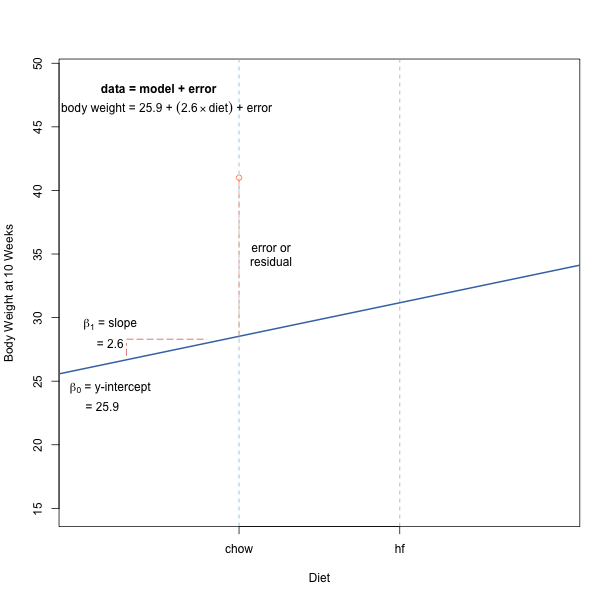
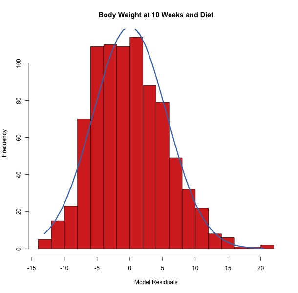
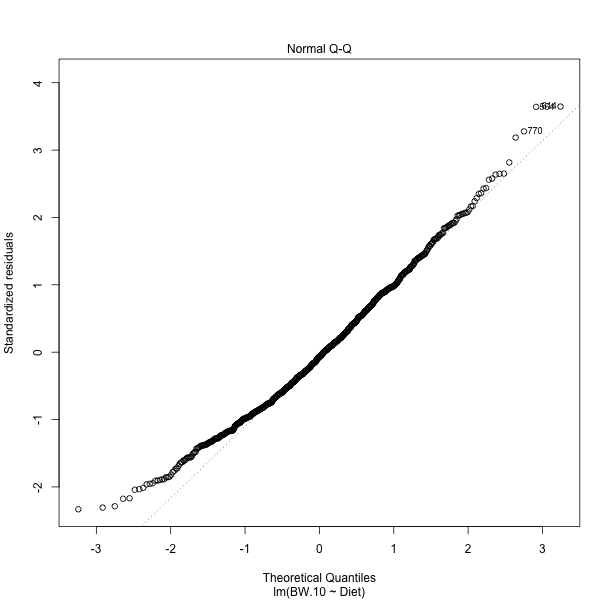
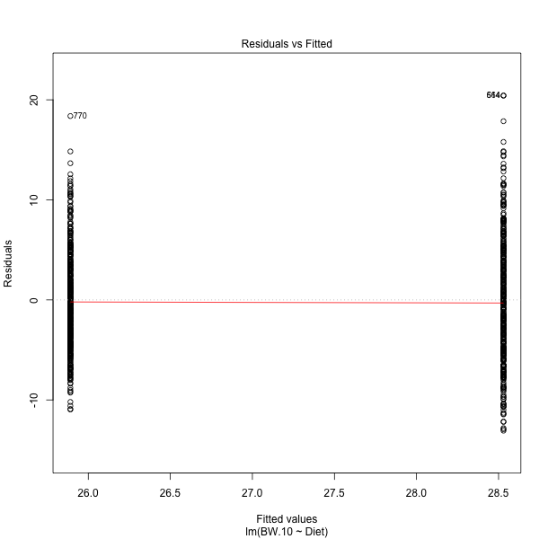
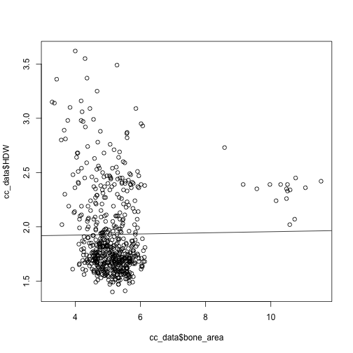
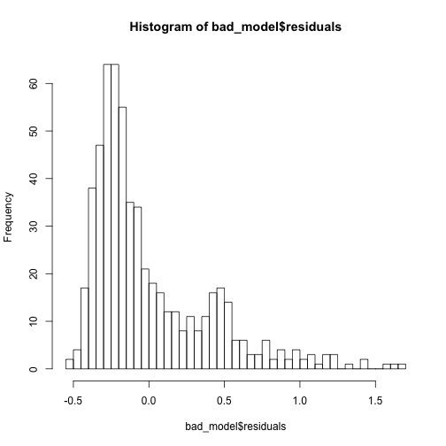
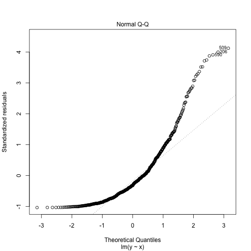
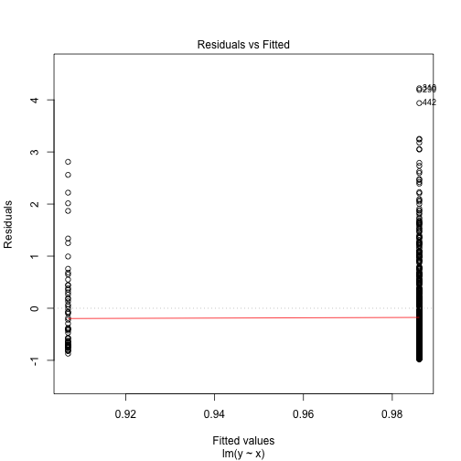
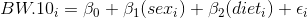

---
# Please do not edit this file directly; it is auto generated.
# Instead, please edit 05-anova.md in _episodes_rmd/
title: "Linear regression and analysis of variance"
teaching: 0
exercises: 0
questions:
- "?"
- "?"
objectives:
- "Understand the assumptions behind linear models and ANOVA."
- "Perform ANOVA and interpret results."
keypoints:
- "When performing a linear regression or ANOVA, ensure that data meet the assumptions for this chosen method."
source: Rmd
---

## Linear Regression
Linear regression describes how one variable changes dependent on another.
We can use linear regression to predict the mean value of a dependent, or response variable according to the value of an independent variable, or predictor. In the following example we'll explore how body weight changes depending on diet composition. 

## Data

This data set contains body weights for 846 male (M) and female (F) mice fed a high fat (hf) and control (chow) diet measured repeatedly over 23  time points (BW.3 – BW.30).  Many mice do not have measurements for all body weight as survival time varies across sample.  Data set includes additional information, such as litter number and coat color. Load the data and have a quick look.

~~~
pheno <- read.csv(file = "bodyWeights.csv", stringsAsFactors = FALSE)
names(pheno)
~~~
{: .language-r}

~~~
 [1] "Sample"     "Sex"        "Gen"        "Litter"     "Diet"      
 [6] "Coat.Color" "BW.3"       "BW.4"       "BW.5"       "BW.6"      
[11] "BW.7"       "BW.8"       "BW.9"       "BW.10"      "BW.11"     
[16] "BW.12"      "BW.13"      "BW.14"      "BW.15"      "BW.16"     
[21] "BW.17"      "BW.18"      "BW.19"      "BW.20"      "BW.21"     
[26] "BW.22"      "BW.23"      "BW.24"      "BW.25"      "BW.26"     
[31] "BW.27"      "BW.28"      "BW.29"      "BW.30"     
~~~
{: .output}

~~~
head(pheno)
~~~
{: .language-r}

~~~
  Sample Sex Gen Litter Diet Coat.Color BW.3 BW.4  BW.5  BW.6  BW.7  BW.8
1    F01   F   4      2   hf     agouti   NA   NA 17.58 22.31 25.12 26.32
2    F02   F   4      2   hf      black   NA   NA 19.70 24.74 26.08 28.36
3    F03   F   4      2   hf      white   NA   NA 18.53 20.82 20.07 20.61
4    F04   F   4      2   hf     agouti   NA   NA 14.02 17.39 18.47 19.07
5    F05   F   4      2   hf     agouti   NA   NA 18.54 23.54 22.77 25.22
6    F06   F   4      2   hf     agouti   NA   NA 17.59 20.06 20.09 21.00
   BW.9 BW.10 BW.11 BW.12 BW.13 BW.14 BW.15 BW.16 BW.17 BW.18 BW.19 BW.20
1 29.38 29.45 30.22 31.94 30.61 33.87 35.17 36.45 34.63 36.42 36.78 35.46
2 30.09 30.76 30.47 32.48 32.37 33.53 33.58 35.69 35.62 37.23 37.65 35.76
3 20.96 22.01 21.48 22.82 22.33 22.78 21.41 23.60 23.12 23.67 24.37 24.12
4 18.97 18.85 19.72 19.92 19.29 19.38 17.96 20.27 19.80 21.24 21.51 21.09
5 27.54 27.52 29.24 32.22 33.76 33.31 33.07 35.25 35.06 37.46 39.35 39.38
6 23.31 24.65 25.14 27.50 28.55 31.02 30.59 33.78 34.03 37.45 37.57 35.30
  BW.21 BW.22 BW.23 BW.24 BW.25 BW.26 BW.27 BW.28 BW.29 BW.30
1 36.31    NA    NA    NA    NA    NA    NA    NA    NA    NA
2 35.63    NA    NA    NA    NA    NA    NA    NA    NA    NA
3 24.00    NA    NA    NA    NA    NA    NA    NA    NA    NA
4 20.55    NA    NA    NA    NA    NA    NA    NA    NA    NA
5 39.02    NA    NA    NA    NA    NA    NA    NA    NA    NA
6 35.76    NA    NA    NA    NA    NA    NA    NA    NA    NA
~~~
{: .output}

The data are from a repeated measures design, in which the same subject is measured over time. Although this data represents a repeated measures experiment, it can also be analyzed as ANOVA (Analysis of Variance) by evaluating only a single time point’s body weight measurement.  Due to the additional complexity of a repeated measures experiment over a standard ANOVA, the following statistical analysis example will focus only on the analysis of body weights at 10 weeks (BW.10).

## Statistical Analysis Assumptions (of Linear Regression / ANOVA)
To ensure that a statistical analysis can accurately evaluate a data set, there are certain criteria (or assumptions) that need to be met.

For our analysis of body weight at 10 weeks and diet, the following assumptions should be met:

1. The model is good (i.e. the relationship is linear and not, for example, quadratic or exponential).  
1. The residuals have a normal distribution.  
1. The residuals have equal variance (homoscedastic).  

In the following example, we model body weight at 10 weeks as a function of diet.

The residuals (or errors) are the distance of each data point from the line describing the linear model, as shown above. If we look at a histogram of the residuals, they should be normally distributed.

Let's create the model and explore the residuals and fitted values.

~~~
# Model body weight at 10 weeks as a function of diet
model <- lm(BW.10 ~ Diet, data = pheno)
summary(model)
~~~
{: .language-r}

~~~

Call:
lm(formula = BW.10 ~ Diet, data = pheno)

Residuals:
     Min       1Q   Median       3Q      Max 
-13.0701  -4.2509  -0.4101   3.7741  20.4399 

Coefficients:
            Estimate Std. Error t value Pr(>|t|)    
(Intercept)  25.8909     0.2649  97.739  < 2e-16 ***
Diethf        2.6392     0.3875   6.811 1.84e-11 ***
---
Signif. codes:  0 '***' 0.001 '**' 0.01 '*' 0.05 '.' 0.1 ' ' 1

Residual standard error: 5.613 on 841 degrees of freedom
  (3 observations deleted due to missingness)
Multiple R-squared:  0.05228,	Adjusted R-squared:  0.05116 
F-statistic:  46.4 on 1 and 841 DF,  p-value: 1.84e-11
~~~
{: .output}

~~~
# Look at the first few values of the residuals
head(model$residuals)
~~~
{: .language-r}

~~~
         1          2          3          4          5          6 
 0.9198985  2.2298985 -6.5201015 -9.6801015 -1.0101015 -3.8801015 
~~~
{: .output}

~~~
# Look at the first few values fitted by the model
head(model$fitted.values)
~~~
{: .language-r}

~~~
      1       2       3       4       5       6 
28.5301 28.5301 28.5301 28.5301 28.5301 28.5301 
~~~
{: .output}

Note that the first several fitted values are the same. These are the predicted mean body weights for a high-fat  diet. What are the predicted values for a standard chow diet?

~~~
table(model$fitted.values)
~~~
{: .language-r}

~~~

25.8908530066815 28.5301015228422 28.5301015228424 28.5301015228426 
             449                1                1              392 
~~~
{: .output}

The difference between predicted values for standard chow vs. high-fat diet is approximately 2.6, which is the slope of the line describing the linear model. 

Now create a histogram of the residuals to check for a normal distribution.

~~~
hist(model$residuals, breaks = 20)
~~~
{: .language-r}

We can also use a quantile vs. quantile (Q-Q) plot to compare the residuals to a normal distribution. 

~~~
plot(model, which = 2)
~~~
{: .language-r}

The Q-Q plot indicates 3 data points that are outliers along with their index numbers. Otherwise, most of the points lie along the diagonal line, indicating that the residuals are normally distributed. 

You can also plot the residuals against the fitted values in the model.

~~~
plot(model, which = 1)
~~~
{: .language-r}

Note that the residuals are plotted along one of two fitted values - the one for standard chow (25.9), or the predicted value for high-fat diet (28.5). There should be constant variance vertically and points should scatter symmetrically around zero. The plot indicates the 3 data points that stand out as outliers, with index numbers supplied for each.   

## A Bad Model
Now let's look at one that is unmistakably bad. This is a linear model of hemoglobin concentration distribution width (HDW) and bone area from a multi-system survey of mouse physiology in 8 inbred founder strains and 54 F1 hybrids of the Collaborative Cross. The study is described in [Lenarcic et al, 2012](http://www.genetics.org/content/190/2/413.full). For more information about this data set, see the [CGDpheno3 data](http://phenome.jax.org/db/q?rtn=projects/details&id=439) at Mouse Phenome Database. 

Load the data from this URL. Mind the double quotes.

~~~
cc_data <- read.csv(file = "http://phenomedoc.jax.org/MPD_projdatasets/CGDpheno3.csv")

# Create the model of hemoglobin concentration distribution width (HDW) and bone area.
bad_model <- lm(formula = HDW ~ bone_area, data = cc_data)

# Plot the regression line in a scatterplot.
plot(x = cc_data$bone_area, y = cc_data$HDW)
abline(bad_model)
~~~
{: .language-r}

~~~
summary(bad_model)
~~~
{: .language-r}

~~~

Call:
lm(formula = HDW ~ bone_area, data = cc_data)

Residuals:
    Min      1Q  Median      3Q     Max 
-0.5296 -0.2630 -0.1530  0.1712  1.6964 

Coefficients:
            Estimate Std. Error t value Pr(>|t|)    
(Intercept) 1.902727   0.085920  22.145   <2e-16 ***
bone_area   0.005231   0.016195   0.323    0.747    
---
Signif. codes:  0 '***' 0.001 '**' 0.01 '*' 0.05 '.' 0.1 ' ' 1

Residual standard error: 0.395 on 576 degrees of freedom
  (64 observations deleted due to missingness)
Multiple R-squared:  0.0001811,	Adjusted R-squared:  -0.001555 
F-statistic: 0.1043 on 1 and 576 DF,  p-value: 0.7468
~~~
{: .output}

Note the values for the F-statistic and the R-squared. Also notice that beta, the slope, is near zero, indicating no relationship between the two variables.

~~~
hist(x = bad_model$residuals, breaks=40)
~~~
{: .language-r}

~~~
plot(bad_model, which=2)
~~~
{: .language-r}

~~~
plot(bad_model, which=1)
~~~
{: .language-r}

The histogram doesn't show a normal distribution, and mean residual value doesn't appear to be near zero. In the Q-Q plot most of the data points are off-diagonal. The plot of residuals vs. fitted values appears parabolic, indicating poor model fit.

## The Model

Evaluating the assumptions of the statistical test requires that a model be created.  A statistical model is a mathematical representation of the factors that can be used to predict a certain value.  For example, in our effort to predict BW.10 data, we are using the sex and diet of mice which are represented in the form of a statistical model.

The first step in analyzing data is to create an appropriate model.  Given our data set, we would like to determine if the dependent variable of body weight (BW.10) is influenced by the independent variables sex and diet.  The model for this analysis is:

where,
<i>y</i> = <i>&alpha;</i> + <i>&beta;X</i> + <i>&epsilon;</i>

<i>yi</i> = the dependent (or response variable), Body Weight (BW.10), associated with sample <i>i</i>.

The subscript <i>i</i> refers to the individual sample

In our data set, the <i>i</i> subscript refers to the ID in the Sample column of the data set.

The response variable, <i>BW.10</i>, is a quantity that varies in a way that we hope to be able to summarize and exploit via the modeling process. Generally, it is known that the variation of the response variable is systematically related to the values of one or more other variables (such as, Sex and Diet) before the modeling process is begun, although testing the existence and nature of this dependence is part of the modeling process itself.

The mathematical function consists of two main parts. These parts are known as the predictor variables (or regressors), e.g., <i>sexi</i>,… , and the parameters (or regression coefficients), e.g., <i>&beta;1</i>,….

The below parameters (or regression coefficients) are constants that do not change according to sample, sex, or diet.

<i>&beta;0</i> = mean intercept (or constant); for scientific studies the intercept is often not of interest and is only used to aid in calculation of predicted values

<i>&beta;1</i> = parameter associated with the regressor Sex

<i>&beta;2</i> = parameter associated with the regressor Diet

The parameters are the quantities that will be estimated during the modeling process. Their true values are unknown and unknowable, except in simulation experiments.

The relationship (or parameter) between BW.10 and Sex and Diet is the same regardless of which sample is evaluated.

<i>sexi</i> = a regressor that varies according to the ith sample’s sex

<i>dieti</i> = a regressor that varies according to the ith sample’s diet

The predictor (or regressor) variables are observed along with the dependent (or response) variable, BW.10.

<i>&epsilon;i</i> = error (or residual) associated with observation i

Like the parameters (or regression coefficients) in the mathematical function, the random errors are unknown. The error (or residual) is simply the difference between what is seen in the data set versus what is predicted by the mathematical function.

Include R example of using aov() to setup an analysis of variance to predict BW.10 using both Sex and Diet factors.  May wish to mention the use of “lme” when you need to account for both fixed and random factors, such as when a random term is required for accounting for technical replicates (or other factors).

## Residual vs. Fitted Plots

A model can be assessed using the residual vs. fitted (or predicted) values plot.  Below is an example of a good (top) and bad (bottom) residual vs. fitted values plot.  Trends (such as a “V” shape) are to be avoided because they possibly indicate nonlinear data.

Include the plot for the BW.10 data.

Find high-quality image of an example of a bad plot.

A residual by predicted plot is commonly used to diagnose nonlinearity or nonconstant error variance. Additionally, it is also used to find outliers (data points that greatly deviate from all other points).

## Outliers

If outliers are believed to be present in the data, data transformation may be considered.  Alternatively, if outlier values are believed to be the result of real error (e.g. calculation error, data entry, etc.) then they may be removed from the dataset.  Excluding values must only be done for legitimate reasons, or else you may affect the Type 1 (false positive) error rate.

Include plot of distribution of data (include R box plot code).  Highlight any outliers.  Go over how to read a box plot.  Show example of outliers if none are present in data.

## The residuals

Residuals are estimates of experimental error obtained by subtracting the observed responses from the predicted responses (or actual data from data set minus what is predicted by the model).  The predicted response is calculated from the chosen model, after all the unknown model parameters have been estimated from the experimental data.  Examining residuals is a key part of all statistical modeling.  Carefully looking at residuals can tell us whether our assumptions are reasonable and our choice of model is appropriate.

Residuals are elements of variation unexplained by the fitted model.  Residuals should be (roughly) normal and (approximately) independently distributed with a mean of zero and some constant variance.  If error is not normal or independently distributed this would indicate that a different (nonlinear) model may be more suitable to analyze the data or that other significant factors need to be accounted for.  For example, if predicting BW.10 we only used a model with Sex, we may obtain poor residual plots because we are failing to account for a crucial factor, such as, Diet.  Show example of residual plots only using Sex (and provide the R code).

## 2.2.1 Normal Probability Plot

Residual normality can be evaluated via a QQ (quantile-quantile plot).  Provide an example of a QQ plot and R code.

## Failures
fail to log transform data - produce bar plots that start at zero and  with error bars successively larger error bars, statistical significance shown - see Science p.1091 8 june 2018, also p. 1128
ttest or anova assumes equal variances, assuming same here
makes data normal, stabilizes variance

another example - throwing out outliers
