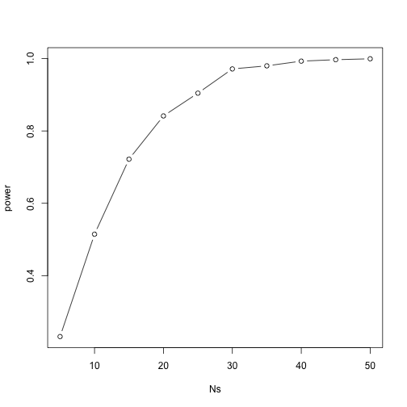
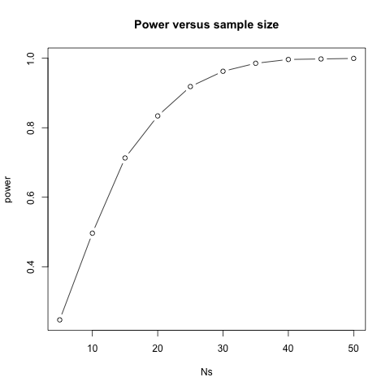
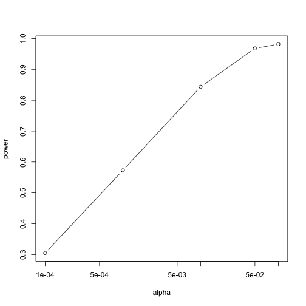
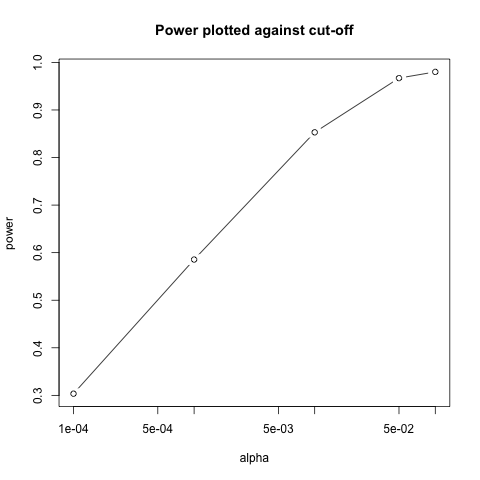

---
# Please do not edit this file directly; it is auto generated.
# Instead, please edit 05-power-calc.md in _episodes_rmd/
title: Power calculation
teaching: 0
exercises: 0
questions:
- ""
- "?"
objectives:
- ""
- ""
- ""
keypoints:
- "When designing an experiment, use biological replicates."
- "Choose a single representative value (the mean, median, or mode) for technical replicates."
source: Rmd
---

[A Biologist Talks to a Statistician](https://www.youtube.com/watch?v=Hz1fyhVOjr4)

## Motivator: A retraction

Statistical power analysis is important in experimental design. Statistical power refers to the ability to avoid type II (false negative) errors, or rejection of an experimental hypothesis when it is actually true. See Doug Melton's retraction of betatrophin paper in the journal Cell.
https://retractionwatch.com/2016/12/27/harvard-biologist-retracts-diabetes-breakthrough-cell/
"When we repeated our original experiments with a larger number of mice, we also failed to observe β-cell expansion"

"In retrospect, he said he wished he’d performed the original experiment with more mice (“more attention to the statistical strength is a lesson that I’ve learned”), but the experiments with Kushner and his colleagues taught him the primary mistake was that the lab had miscounted the number of beta cells"

## Power Calculations 

#### Introduction

We have used the example of the effects of two different diets on the weight of mice. Since in this illustrative example we have access to the population, we know that in fact there is a substantial difference (greater than 18%) between the average weights of the two male populations at 21 weeks of age.

~~~
library(downloader)
url <- "https://raw.githubusercontent.com/smcclatchy/dals-inference/gh-pages/data/bodyWeights.csv"
filename <- "bodyWeights.csv"
if(!file.exists(filename)) download(url,destfile=filename)
~~~
{: .language-r}

~~~
library(dplyr)

# Read in DO850 body weight data.
dat <- read.csv("bodyWeights.csv") 
controlPopulation <- filter(dat, Sex == "M" & Diet == "chow") %>%  
  select(BW.21) %>% unlist

hfPopulation <- filter(dat, Sex == "M" & Diet == "hf") %>%  
  select(BW.21) %>% unlist

mu_hf <- mean(hfPopulation, na.rm = TRUE)
mu_control <- mean(controlPopulation, na.rm = TRUE)
print(mu_hf - mu_control)
~~~
{: .language-r}

~~~
[1] 6.696912
~~~
{: .output}

~~~
# All code and text below is from Irizarry & Love
# http://genomicsclass.github.io/book/pages/power_calculations.html
# Exercises
# http://genomicsclass.github.io/book/pages/power_calculations_exercises.html
~~~
{: .language-r}

We have also seen that, in some cases, when we take a sample and perform a t-test, we don't always get a p-value smaller than 0.05. For example, here is a case where we take a sample of 5 mice and don't achieve statistical significance at the 0.05 level:

~~~
# this needs updating for the DO data

set.seed(1)
N <- 5
hf <- sample(hfPopulation,N)
control <- sample(controlPopulation,N)
t.test(hf,control)$p.value
~~~
{: .language-r}

~~~
[1] 0.05431597
~~~
{: .output}

Did we make a mistake? By not rejecting the null hypothesis, are we
saying the diet has no effect? The answer to this question is no. All
we can say is that we did not reject the null hypothesis. But this
does not necessarily imply that the null is true. The problem is that,
in this particular instance, we don't have enough _power_, a term we
are now going to define. If you are doing scientific research, it is
very likely that you will have to do a power calculation at some
point. In many cases, it is an ethical obligation as it can help you
avoid sacrificing mice unnecessarily or limiting the number of human
subjects exposed to potential risk in a study. Here we explain what
statistical power means. 

#### Types of Error

Whenever we perform a statistical test, we are aware that we may make a
mistake. This is why our p-values are not 0. Under the null, there is
always a positive, perhaps very small, but still positive chance that we
will reject the null when it is true. If the p-value is 0.05, it will
happen 1 out of 20 times. This *error* is called _type I error_ by
statisticians. 

A type I error is defined as rejecting the null when we should
not. This is also referred to as a false positive. So why do we then
use 0.05? Shouldn't we use 0.000001 to be really sure? The reason we
don't use infinitesimal cut-offs to avoid type I errors at all cost is
that there is another error we can commit: to not reject the null when we
should. This is called a _type II error_ or a false negative. The R
code analysis above shows an example of a false negative: we did not
reject the null hypothesis (at the 0.05 level) and, because we happen
to know and peeked at the true population means, we know there is in fact a
difference. Had we used a p-value cutoff of 0.25, we would not have
made this mistake. However, in general, are we comfortable with a type
I error rate of 1 in 4? Usually we are not.  

#### The 0.05 and 0.01 Cut-offs Are Arbitrary

Most journals and regulatory agencies frequently insist that results be significant at the 0.01 or 0.05 levels. Of course there is nothing special about these numbers other than the fact that some of the first papers on p-values used these values as examples. Part of the goal of this book is to give readers a good understanding of what p-values and confidence intervals are so that these choices can be judged in an informed way. Unfortunately, in science, these cut-offs are applied somewhat mindlessly, but that topic is part of a complicated debate.

#### Power Calculation

Power is the probability of rejecting the null when the null is
false. Of course "when the null is false" is a complicated statement
because it can be false in many ways.
$\Delta \equiv \mu_Y - \mu_X$
could be anything and the power actually depends on this parameter. It
also depends on the standard error of your estimates which in turn
depends on the sample size and the population standard deviations. In
practice, we don't know these so we usually report power for several
plausible values of $\Delta$, $\sigma_X$, $\sigma_Y$ and various
sample sizes.
Statistical theory gives us formulas to calculate
power. The `pwr` package performs these calculations for you. Here we
will illustrate the concepts behind power by coding up simulations in R. 

Suppose our sample size is: 

~~~
N <- 12
~~~
{: .language-r}

and we will reject the null hypothesis at:

~~~
alpha <- 0.05
~~~
{: .language-r}

What is our power with this particular data? We will compute this probability by re-running the exercise many times and calculating the proportion of times the null hypothesis is rejected. Specifically, we will run: 

~~~
B <- 2000
~~~
{: .language-r}

simulations. The simulation is as follows: we take a sample of size $N$ from both control and treatment groups, we perform a t-test comparing these two, and report if the p-value is less than `alpha` or not. We write a function that does this:

~~~
reject <- function(N, alpha=0.05){
   hf <- sample(hfPopulation,N) 
   control <- sample(controlPopulation,N)
   pval <- t.test(hf,control)$p.value
   pval < alpha
}
~~~
{: .language-r}

Here is an example of one simulation for a sample size of 12. The call to `reject` answers the question "Did we reject?" 

~~~
reject(12)
~~~
{: .language-r}

~~~
[1] TRUE
~~~
{: .output}

Now we can use the `replicate` function to do this `B` times. 

~~~
rejections <- replicate(B, reject(N))
~~~
{: .language-r}

Our power is just the proportion of times we correctly reject. So with  $N=12$ our power is only: 

~~~
mean(rejections)
~~~
{: .language-r}

~~~
[1] 0.5935
~~~
{: .output}

This explains why the t-test was not rejecting when we knew the null
was false. With a sample size of just 12, our power is about 23%. To
guard against false positives at the 0.05 level, we had set the
threshold at a high enough level that resulted in many type II
errors. 

Let's see how power improves with N. We will use the function `sapply`, which applies a function to each of the elements of a vector. We want to repeat the above for the following sample size:

~~~
Ns <- seq(5, 50, 5)
~~~
{: .language-r}

So we use `apply` like this:

~~~
power <- sapply(Ns,function(N){
  rejections <- replicate(B, reject(N))
  mean(rejections)
  })
~~~
{: .language-r}

For each of the three simulations, the above code returns the proportion of times we reject. Not surprisingly power increases with N:

~~~
plot(Ns, power, type="b")
~~~
{: .language-r}

Similarly, if we change the level `alpha` at which we reject, power
changes. The smaller I want the chance of type I error to be, the less
power I will have. Another way of saying this is that we trade off
between the two types of error. We can see this by writing similar code, but
keeping $N$ fixed and considering several values of `alpha`:

~~~
N <- 30
alphas <- c(0.1,0.05,0.01,0.001,0.0001)
power <- sapply(alphas,function(alpha){
  rejections <- replicate(B,reject(N,alpha=alpha))
  mean(rejections)
})
plot(alphas, power, xlab="alpha", type="b", log="x")
~~~
{: .language-r}

Note that the x-axis in this last plot is in the log scale.

There is no "right" power or "right" alpha level, but it is important that you understand what each means.

To see this clearly, you could create a plot with curves of power versus N. Show several curves in the same plot with color representing alpha level.

#### p-values Are Arbitrary under the Alternative Hypothesis

Another consequence of what we have learned about power is that
p-values are somewhat arbitrary when the 
null hypothesis is not true and therefore
the *alternative* hypothesis is true (the
difference between the population means is not zero).
When the alternative hypothesis is true, 
we can make a p-value as small as we want simply by increasing
the sample size (supposing that we have an infinite population to sample
from). We can show this property of p-values
by drawing larger and larger samples from our
population and calculating p-values. This works because, in our case,
we know that the alternative hypothesis is true, since we have
access to the populations and can calculate the difference in their means.

First write a function that returns a p-value for a given sample size $N$:

~~~
calculatePvalue <- function(N) {
   hf <- sample(hfPopulation,N) 
   control <- sample(controlPopulation,N)
   t.test(hf,control)$p.value
}
~~~
{: .language-r}

We have a limit here of 200 for the high-fat diet population, but we can
see the effect well before we get to 200.
For each sample size, we will calculate a few p-values. We can do
this by repeating each value of $N$ a few times.

~~~
Ns <- seq(10,200,by=10)
Ns_rep <- rep(Ns, each=10)
~~~
{: .language-r}

Again we use `sapply` to run our simulations:

~~~
pvalues <- sapply(Ns_rep, calculatePvalue)
~~~
{: .language-r}

~~~
Error in sample.int(length(x), size, replace, prob): cannot take a sample larger than the population when 'replace = FALSE'
~~~
{: .error}

Now we can plot the 10 p-values we generated for each sample size:

~~~
plot(Ns_rep, pvalues, log="y", xlab="sample size",
     ylab="p-values")
~~~
{: .language-r}

~~~
Error in xy.coords(x, y, xlabel, ylabel, log): object 'pvalues' not found
~~~
{: .error}

~~~
abline(h=c(.01, .05), col="red", lwd=2)
~~~
{: .language-r}

~~~
Error in int_abline(a = a, b = b, h = h, v = v, untf = untf, ...): plot.new has not been called yet
~~~
{: .error}

Note that the y-axis is log scale and that the p-values show a
decreasing trend all the way to $10^{-8}$
as the sample size gets larger. The standard cutoffs
of 0.01 and 0.05 are indicated with horizontal red lines.

It is important to remember that p-values are not more interesting as
they become very very small. Once we have convinced ourselves to
reject the null hypothesis at a threshold we find reasonable, having
an even smaller p-value just means that we sampled more mice than was
necessary.  Having a larger sample size does help to increase the
precision of our estimate of the difference $\Delta$, but the fact
that the p-value becomes very very small is just a natural consequence
of the mathematics of the test.  The p-values get smaller and smaller
with increasing sample size because the numerator of the t-statistic
has $\sqrt{N}$ (for equal sized groups, and a similar effect occurs
when $M \neq N$). Therefore, if $\Delta$ is non-zero, the t-statistic
will increase with $N$.

Therefore, a better statistic to report is the effect size with
a confidence interval or some statistic which gives the reader a
sense of the change in a meaningful scale. We can
report the effect size as a percent by dividing the difference
and the confidence interval by the control population mean:

~~~
N <- 12
hf <- sample(hfPopulation, N)
control <- sample(controlPopulation, N)
diff <- mean(hf) - mean(control)
diff / mean(control) * 100
~~~
{: .language-r}

~~~
[1] 15.99043
~~~
{: .output}

~~~
t.test(hf, control)$conf.int / mean(control) * 100
~~~
{: .language-r}

~~~
[1] -0.2599845 32.2408348
attr(,"conf.level")
[1] 0.95
~~~
{: .output}

In addition, we can report a statistic called
[Cohen's d](https://en.wikipedia.org/wiki/Effect_size#Cohen.27s_d),
which is the difference between the groups divided by the pooled standard
deviation of the two groups. 

~~~
sd_pool <- sqrt(((N-1)*var(hf) + (N-1)*var(control))/(2*N - 2))
diff / sd_pool
~~~
{: .language-r}

~~~
[1] 0.8331424
~~~
{: .output}

This tells us how many standard deviations of the data the mean of the
high-fat diet group is from the control group. Under the
alternative hypothesis, unlike the t-statistic which is guaranteed to
increase, the effect size and Cohen's d will become more precise.

> ## Challenge 1: Power and sample size calculation for two treatment comparison (Gary's suggestion)
> 1). Specify power and size of test, variance, meaningful difference. Compute N.  
> 2). Specify N, power, variance. Compute meaningful difference (what can I hope to get with my budget fixed?).
>
> > ## Solution to Challenge 1
> > 
> {: .solution}
{: .challenge}

> ## Challenge 2: Draw some power curves (Gary's suggestion)
> 1). How are they affected by alpha, beta, delta, N?
> 2). If you double the sample size how does delta change?
> Use formulas, functions, statistical rules of thumb.
>
> > ## Solution to Challenge 2
> > 
> {: .solution}
{: .challenge}

> ## Challenge 3: Compute power by simulation (Gary's suggestion)
> Learn how to simulate data.
> Draw power curves from simulations. Compare to theoretical curves.
> > ## Solution to Challenge 3
> > 
> {: .solution}
{: .challenge}

> ## Challenge 4 (advanced): Permutation tests (Gary's suggestion)
> 
> > ## Solution to Challenge 4
> > 
> {: .solution}
{: .challenge}
