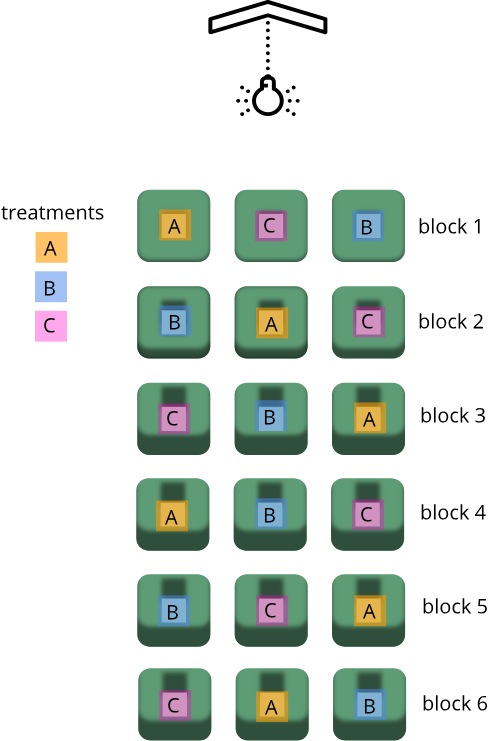
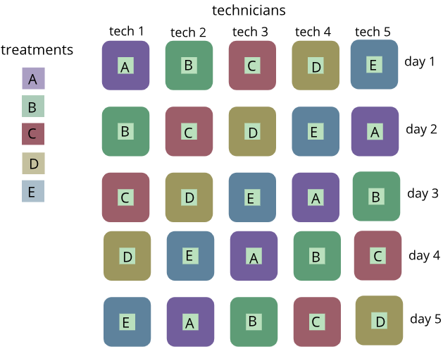

---
# Please do not edit this file directly; it is auto generated.
# Instead, please edit 08-randomized-designs.md in _episodes_rmd/
title: "Experimental designs"
teaching: 0
exercises: 0
questions:
- "What are my experimental units?"
- "How will treatments be assigned?"
- "What are some types of experimental design?"
objectives:
- ""
- ""
keypoints:
- "Well-designed experiments are randomized, have adequate replicates, and feature local control of environmental variables."
- "."
source: Rmd
---

~~~
library(downloader)
url <- "https://raw.githubusercontent.com/smcclatchy/dals-inference/gh-pages/data/bodyWeights.csv"
filename <- "bodyWeights.csv"
if(!file.exists(filename)) download(url,destfile=filename)
~~~
{: .language-r}

~~~
library(dplyr)

# Read in DO850 body weight data.
dat <- read.csv("bodyWeights.csv")  
~~~
{: .language-r}

A designed experiment is a strategic attempt to answer a research question or problem. Well-designed experiments are characterized by three features: randomization, replication, and control. These features help to minimize the impact of experimental error and factors not under study.

### Randomization
In a randomized experiment, the investigators randomly assign subjects to treatment and control groups in order to minimize bias and moderate experimental error. A random number table or generator can be used to assign random numbers to experimental units so that any experimental unit has equal chances of being assigned to treatment or control. The random number then determines to which group an experimental unit belongs. For example, odd-numbered experimental units could go in the treatment group, and even-numbered experimental units in the control group.

Here is an example of randomization using a random number generator.

~~~
sample_id <- LETTERS
random_number <- sample(100, 26)
group <- ifelse(random_number %% 2 == 0, "control", "treatment")
df1 <- data.frame(sample_id, random_number, group)
df1
~~~
{: .language-r}

~~~
   sample_id random_number     group
1          A            94   control
2          B            25 treatment
3          C            54   control
4          D             1 treatment
5          E            28   control
6          F            70   control
7          G            33 treatment
8          H            45 treatment
9          I            62   control
10         J            66   control
11         K            73 treatment
12         L            64   control
13         M            44   control
14         N            47 treatment
15         O             6   control
16         P            99 treatment
17         Q            98   control
18         R            46   control
19         S            61 treatment
20         T            56   control
21         U            16   control
22         V            12   control
23         W            37 treatment
24         X            48   control
25         Y            32   control
26         Z            93 treatment
~~~
{: .output}

This might produce unequal numbers between treatment and control groups. It isn't necessary to have equal numbers, however, sensitivity (the true positive rate, or ability detect of an effect when it truly exists) is maximized when sample numbers are equal.

~~~
table(df1$group)
~~~
{: .language-r}

~~~

  control treatment 
       16        10 
~~~
{: .output}

### Replication
Replication can characterize variation or experimental error ("noise") in an experiment. Systematic error can be characterized with technical replicates, which measure the same sample multiple times and estimate the variation caused by equipment or protocols. Random biological variation can be characterized with biological replicates, which measure different biological samples in parallel. The greater the number of replications, the greater the precision (i.e., the degree to which repeated measurements under unchanged conditions show the same results) in the experiment.

### Local control
Local control refers to refinements in experimental design to control the impact of factors not addressed by replication or randomization. Local control should not be confused with the control group, the group that does not receive treatment.

As an example of local control, if a rack of many mice cages is heterogeneous with respect to light exposure, then the rack of cages can be divided into smaller blocks such that cages within each block tend to be more homogeneous (have equal light exposure). This kind of homogeneity of cages (experimental units) ensures an unbiased comparison of treatment means (each block would receive all treatments instead of each block receiving only one or several), as otherwise it would be difficult to attribute the mean difference between treatments solely to differences between treatments when cage light exposures differences also persist. This type of local control to achieve homogeneity of experimental units will not only increase the accuracy of the experiment, but also help in arriving at valid conclusions.

#### Completely randomized design
The completely randomized design is simple and common in controlled experiments. In a completely randomized design, each experimental unit (e.g. mouse) has an equal probability of assignment to any treatment. The following example demonstrates a completely randomized design for 4 treatment groups and 5 replicates of each treatment group, for a total of 20 experimental units.

~~~
# create IDs and random numbers in vectors of equal length
exp_unit_id <- LETTERS[1:20]
random_number <- sample(100, 20)

# place IDs and random numbers in data frame
df2 <- data.frame(exp_unit_id, random_number)

# sort by  random numbers
df2 <- df2[order(random_number),]

# now assign to treatment groups
treatment <- sort(rep(c("treatment1","treatment2","treatment3","control"), 5))
df2 <- cbind(df2, treatment)
df2
~~~
{: .language-r}

~~~
   exp_unit_id random_number  treatment
12           L             1    control
7            G             3    control
3            C            11    control
8            H            17    control
10           J            18    control
14           N            27 treatment1
17           Q            37 treatment1
11           K            40 treatment1
5            E            43 treatment1
9            I            47 treatment1
6            F            54 treatment2
16           P            55 treatment2
18           R            64 treatment2
20           T            65 treatment2
13           M            78 treatment2
19           S            80 treatment3
1            A            83 treatment3
4            D            84 treatment3
2            B            89 treatment3
15           O            94 treatment3
~~~
{: .output}

By assigning 5 experimental units to each treatment group, the numbers in each group are equal. A completely randomized design will work with unequal numbers, though.

~~~
table(df2$treatment)
~~~
{: .language-r}

~~~

   control treatment1 treatment2 treatment3 
         5          5          5          5 
~~~
{: .output}

In a completely randomized design, any difference between experimental units under the same treatment is considered experimental error. A completely randomized design is appropriate only for experiments with homogeneous experimental units, where environmental effects such as light or temperature are relatively easy to control. The completely randomized design is rarely used in field studies for this reason.

#### Randomized complete block design
The randomized complete block design is a popular experimental design suited for studies where a researcher is concerned with studying the effects of a single factor on a response of interest. Furthermore, the study includes variability from another factor that is not of particular interest; often referred to as nuisance factor. The primary distinguishing feature of the randomized complete block design is that the blocks are of equal size and contain all of the treatments, to control the effects of variables that are not of interest. For example, a block may refer to an area that receives a certain amount of light, and within one area (or block) the light doesn’t differ much but across areas (blocks) they may differ greatly. Blocking reduces experimental error by eliminating known sources of variation among experimental units. 

If certain operations, such as data collection, cannot be completed for the whole experiment in one day, the task should be completed for all experimental units of the same block on the same day. This way the variation among days becomes part of block variation and is, thus, excluded from the experimental error. If more than one person takes measurements in a trial, the same person should be assigned to take measurements for the entire block. This way the variation among people (i.e. technicians) would become part of block variation instead of experimental error.

For example, if a rack of mouse cages (e.g., 6 rows by 3 columns) are to be used in an experiment possibly affected by light exposure, researchers may choose to use cages from several of the rows and columns so as to ensure that the effect of light exposure is minimized; the assumption being that cage position (top-to-bottom) in the rack corresponds to varying amounts of light exposure.

In this example, there are three different treatments (A, B, and C). The number of rows (or blocks) will be set to the number of replicates.  Since we are interested in how light exposure differs from top to bottom, we will want our blocks to convey that difference; hence blocks should correspond to rows in the rack as each row is believed to have a different amount of light exposure.  It is not necessary that there be enough replicates so as to account for all combinations of the order of treatments, and there is no need for a replicate size greater than that which accounts for all combinations.  In this example, we are using six replicates which happens to account for all possible combinations of the treatment groups.

The randomized block design controls a source of random variation (a random effect) which might otherwise confound the effect of a treatment, and is of no interest. This design will have one or more treatments (fixed effects) which are of interest. The design is used to increase power by controlling variation from random effects, such as shelf height or illumination. It is also useful for breaking the experiment up into smaller, more convenient mini-experiments.

#### Latin Square Design

Latin square designs are unique in that they allow for (and require) two blocking factors. These designs are used to simultaneously control (or eliminate) two sources of nuisance variability while addressing the effect of (or variability caused by) one factor of interest. For a Latin square design to be created, each of the two blocking factors must have the same number of levels, and that number of levels must also be equal to the number of treatment (or factor of interest) levels.

For example, a Latin square design can be used if there was a study on the effect of five treatments that was done on five different days by five different technicians.

The blocks in this example would be technician (column) and day (row).  The five different treatments (the factor of interest) are denoted by the letters A-E. We can remove the variation from our measured response to treatment in both directions if we consider both rows (day) and columns (technician) as factors in our design.

The Latin Square Design gets its name from the fact that we can write it as a square with Latin letters to correspond to the treatments. The treatment factor levels are the Latin letters in the Latin square design. The number of rows and columns has to correspond to the number of treatment levels. So, if we have five treatments then we would need to have five rows and five columns in order to create a Latin square. This gives us a design where we have each of the treatments and in each row and in each column.

> ## Exercise 1: True or false?
> 1. A completely randomized design can have
> different numbers in each treatment group.
>
> 2. Completely randomized designs tolerate 
> environmental changes, such as lighting 
> differences, over time or space.
>
> 3.A randomized block design ensures that the
> environment is the same for each experimental unit.
>
> 4.  A randomized block design can be used when
> experimental units are heterogeneous in age
> or weight.
>
> >
> > ## Solution to Exercise 1
> > 
> > 1). True. Numbers in each treatment group can differ, though sensitivity (true positive rate) could suffer.
> > 2).
> > 3).
> > 4).
> > 
> {: .solution}
{: .challenge}

> ## Exercise 2: Random assignment to diet
> Use this subset of data containing 20 males and 20 females and
> their baseline body weights to randomize to two different diets: high fat and regular chow.
> `subset <- dat[dat$Sample[c(51:70, 475:494)],c("Sample", "Sex", "BW.3")]`
> 1). Perform a complete randomization.  
> 2). Perform a balanced randomization.  
> 3). Check the sex ratio and difference in body weights.  
> 4). Share the mean body weight for each group on the course etherpad.  
>
> >
> > ## Solution to Exercise 2
> > This requires generation of random numbers. If diets are assigned in order, sample ID will be confounded with body weight if consecutive ID numbers were handled somehow by the same person or in the same way.
> > 1). 
> > 2).
> > 3).
> > 4).
> >
> {: .solution}
{: .challenge}

#### Factorial Design

A factorial design is often used by scientists wishing to understand the effect of two or more independent variables upon a single dependent variable.  The advantages of the factorial design are related to the fact that two or more factors may be assessed at the same time in the same population simultaneously, thus creating a more efficient trial in terms of resources including sample size compared with separate trials for assessment of each parameter.  Each factor has discrete possible values or "levels" (e.g., sex has two levels that are male and female), and whose experimental units take on all possible combinations of these levels across all such factors (e.g., an experiment with two factors sex and treatment will contain samples from all combinations of the two factors).  Factorial designs are named according to the number of factors and the levels of those factors.  For example, an experiment that evaluates the effects of sex (levels of male and female) and treatments (levels of drug and control) would be referred to as a 2 x 2 factorial design; where the first 2 refers to the number of levels of sex and the second 2 refers to the number of levels of the treatment.  If an additional factor was present (e.g., diet with # levels) another number representing the levels of that factor would be included in the name (e.g., 2 x 2 x # factorial design).  If the number of combinations of factor levels in a full factorial design is too high to be logistically feasible, a fractional factorial design may be done (not covered), in which some of the possible combinations (usually at least half) are omitted.  A factorial design has the added benefit of being able to evaluate the interaction of factors, when two (or more) factors interact with each other to affect the dependent variable.  Evaluation of this interaction effect is elucidated through various statistical analyses dependent on the data.

> ## Challenge 2
> Gary's suggestion: Assign mice to diet and running
> wheel. Revisit randomization.
> How to compute sample size?
> Simulate? 
> Other tools?
> Compare the 2x2 experiment sample size to the
> single factor ... not double.
> You get more for your money.
> Two-way ANOVA - main effects, interaction
>
> >
> > ## Solution to Challenge 2
> > 
> {: .solution}
{: .challenge}

