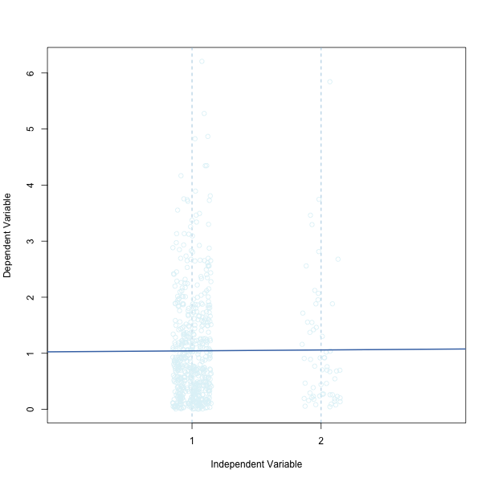

```{r, include=FALSE}
source("../bin/chunk-options.R")
knitr_fig_path("05-")
```

## Linear Regression
Linear regression describes how one variable changes dependent on another one, or two, or more variables.
We can use linear regression to predict the mean value of a dependent, or response variable according to the value of one or more independent variables, or predictors. In the following example we'll explore how body weight (the dependent variable) changes depending on diet composition (the independent variable). 

## Data

This data set contains body weights for 846 male (M) and female (F) mice fed a high fat (hf) and control (chow) diet measured repeatedly over 23  time points (BW.3 – BW.30).  Many mice do not have measurements for all body weight as survival time varies across sample.  Data set includes additional information, such as litter number and coat color. Load the data and have a quick look.

```{r load_data}
pheno <- read.csv(file = "../data/bodyWeights.csv", stringsAsFactors = FALSE)
names(pheno)
head(pheno)
```

The data are from a repeated measures design, in which the same subject is measured over time. Although this data represents a repeated measures experiment, it can also be analyzed as ANOVA (Analysis of Variance) by evaluating only a single time point’s body weight measurement.  Due to the additional complexity of a repeated measures experiment over a standard ANOVA, the following statistical analysis example will focus only on the analysis of body weights at 10 weeks (BW.10).

## Statistical Analysis Assumptions (of Linear Regression / ANOVA)
To ensure that a statistical analysis can accurately evaluate a data set, there are certain criteria (or assumptions) that need to be met.

For our analysis of body weight at 10 weeks and diet, the following assumptions should be met:

1. The model is good (i.e. the relationship is linear and not, for example, quadratic or exponential).  
1. The residuals have a normal distribution.  
1. The residuals have equal variance (homoscedastic).  

In the following example, we model body weight at 10 weeks as a function of diet.


The residuals (or errors; an example represented by the vertical, red-dashed line in the above plot) are the distance of each data point (a light blue circle) from the (blue) line describing the linear model. If we look at a histogram of the residuals, they should be normally distributed.  A normal, or Gaussian, distribution is identified by having a mean, median, and mode that are all equal, and the data generate a curve that is symmetric at the center (or mean).


Let's create the model and explore the residuals and fitted values.

```{r linear_model}
# Model body weight at 10 weeks as a function of diet
model <- lm(formula = BW.10 ~ Diet, data = pheno)
summary(model)
# Look at the first few values of the residuals
head(model$residuals)
# Look at the first few values fitted by the model
head(model$fitted.values)
```

Note that the first several fitted values are the same. These are the predicted mean body weights for a high-fat  diet. What are the predicted values for a standard chow diet?

```{r hf_fitted_values}
table(round(model$fitted.values, digits = 4))
```

The difference between predicted values for standard chow vs. high-fat diet is approximately `r round(as.numeric(names(table(model$fitted.values))[4]) - as.numeric(names(table(model$fitted.values))[1]), digits = 1)`, which is the slope of the line describing the linear model. 

## The residuals

Residuals are estimates of experimental error obtained by subtracting the observed responses from the predicted responses (or actual data from data set minus what is predicted by the model).  The predicted response (or fitted value) is the dependent variable (y-value) that is predicted by the model based on all the accounted for independent variables (x-values). 

A fitted value is simply another name for a predicted value as it describes where a particular x-value fits the line of best fit. It is found by substituting a given value of x into the regression equation. A residual denoted (e) is the difference or error between an observed observation and a predicted or fit value

Examining residuals is a key part of all statistical modeling.  Carefully looking at residuals can tell us whether our assumptions are reasonable and our choice of model is appropriate.

Residuals are elements of variation unexplained by the model.  Residuals should be (roughly) normal and (approximately) independently distributed with a mean of zero and some constant variance.  If error is not normal or independently distributed this would indicate that a different (nonlinear) model may be more suitable to analyze the data or that other significant factors need to be accounted for.  For example, if predicting BW.10 we only used a model with Sex, we may obtain poor residual plots because we are failing to account for a crucial factor, such as, Diet.  Show example of residual plots only using Sex (and provide the R code).

Now create a histogram of the residuals to check for a normal distribution.

```{r histogram, eval=FALSE}
hist(model$residuals, breaks = 20)
```


We can also use a quantile vs. quantile (Q-Q) plot to compare the residuals to a normal distribution. 

```{r qq_plot}
plot(model, which = 2)
```

The Q-Q plot indicates 3 data points that are outliers along with their index numbers. Otherwise, most of the points lie along the diagonal line, indicating that the residuals are normally distributed. 

You can also plot the residuals against the fitted values in the model.

```{r resid_vs_fitted}
plot(model, which = 1)
```

Note that the residuals are plotted along one of two fitted values - the one for standard chow (25.9), or the predicted value for high-fat diet (28.5). There should be constant variance vertically and points should scatter symmetrically around zero. The plot indicates the 3 data points that stand out as outliers, with index numbers supplied for each.   

## A Bad Model
Now let's look at one that is unmistakably bad. This is a linear model created from a fake dataset. Notice that the slope of the line is nearly horizontal.

```{r bad_data, echo=FALSE}
x <- c(rep(1,540), rep(2, 60))
y <- rgamma(600, shape = 1)
bad_data <- data.frame(x, y)
```



If we look at a summary of the linear model, we can see that the residuals aren't normally distributed.

```{r bad_model, echo=FALSE}
bad_model <- lm(formula = y ~ x, data = bad_data)
summary(bad_model)
```

Notice that the slope (Estimate column) is near zero (`r round(bad_model$coefficients[[2]], digits = 6)`), indicating no relationship between the two variables. Also note the values for the F-statistic and the R-squared.  

The histogram for the residuals doesn't show a normal distribution, which is one of the three important assumptions for linear models. In the Q-Q plot most of the data points are off-diagonal.

```{r bad_model_not_normal}
hist(x = bad_model$residuals, breaks=30)
plot(bad_model, which=2)
plot(bad_model, which=1)
```

## Outliers

If outliers are believed to be present in the data, data transformation may be considered.  Alternatively, if outlier values are believed to be the result of real error (e.g. calculation error, data entry, etc.) then they may be removed from the dataset.  Excluding values must only be done for legitimate reasons, or else you may affect the Type 1 (false positive) error rate.

Include plot of distribution of data (include R box plot code).  Highlight any outliers.  Go over how to read a box plot.  Show example of outliers if none are present in data.

## A Model of Body Weight, Sex, and Diet

Let's return to the body weight data to evaluate a model of body weight as a function of both diet and sex. Evaluating the assumptions of the statistical test requires that a model be created.  A statistical model is a mathematical representation of the factors that can be used to predict a certain value.  For example, in our effort to predict body weight at 10 weeks, we will use the sex and diet of mice which are represented in the form of a statistical model.

The first step in analyzing data is to create an appropriate model.  Given our data set, we would like to determine if the dependent variable of body weight (BW.10) is influenced by the independent variables sex and diet.  The model for this analysis is:


where the subscript <i>i</i> refers to the individual sample. The mathematical function consists of two main parts. These parts are known as the predictor variables (or regressors), e.g., <i>sex<sub>i</sub></i>,… , and the parameters (or regression coefficients), e.g., <i>&beta;<sub>1</sub></i>,…. Like the parameters (or regression coefficients) in the mathematical function, the random errors are unknown. The error (or residual) is simply the difference between what is seen in the data set versus what is predicted by the mathematical function.

&nbsp;&nbsp;&nbsp;<i>BW.10<sub>i</sub></i> = the dependent (or response variable), body weight at 10 weeks, associated with sample <i>i</i>.

&nbsp;&nbsp;&nbsp;<i>&beta;<sub>0</sub></i> = mean intercept (or constant); for scientific studies the intercept is often not of interest and is only used to aid in calculation of predicted values. In our first linear model of body weight and diet, <i>&beta;<sub>0</sub></i> (the y-intercept) equaled 25.9. It's not meaningful, however, because it predicts that a mouse on neither diet has a body weight of 25.9.

&nbsp;&nbsp;&nbsp;<i>&beta;<sub>1</sub></i> = parameter associated with the regressor Sex. This number is a constant like the value of 2.6 in the first linear model that we explored.

&nbsp;&nbsp;&nbsp;<i>&beta;<sub>2</sub></i> = parameter associated with the regressor Diet; also a constant.

&nbsp;&nbsp;&nbsp;<i>sex<sub>i</sub></i> = a regressor that varies according to the ith sample’s sex (male or female)

&nbsp;&nbsp;&nbsp;<i>diet<sub>i</sub></i> = a regressor that varies according to the ith sample’s diet (standard chow or high-fat)

&nbsp;&nbsp;&nbsp;<i>&epsilon;<sub>i</sub></i> = error (or residual) associated with observation i

The response variable, <i>BW.10</i>, is a quantity that varies in a way that we hope to be able to summarize and exploit via the modeling process. Generally, it is known that the variation of the response variable is systematically related to the values of one or more other variables (such as, Sex and Diet) before the modeling process is begun, although testing the existence and nature of this dependence is part of the modeling process itself.

```{r linear_model_2}
# Model body weight at 10 weeks as a function of sex and diet
model2 <- lm(formula = BW.10 ~ Sex + Diet, data = pheno)
summary(model2)
# Look at the first few values of the residuals
head(model2$residuals)
# Look at the first few values fitted by the model
head(model2$fitted.values)
```

```{r histogram2}
hist(model2$residuals, breaks = 20)
```

Check for normal distribution of the residuals with a Q-Q plot. 

```{r qq_plot2}
plot(model2, which = 2)
```


Plot the residuals against the fitted values in this second model.

```{r resid_vs_fitted2}
plot(model2, which = 1)
```

Note that there are now 4 different groups - one for each combination of sex and diet.


Include R example of using aov() to setup an analysis of variance to predict BW.10 using both Sex and Diet factors.  May wish to mention the use of “lme” when you need to account for both fixed and random factors, such as when a random term is required for accounting for technical replicates (or other factors).